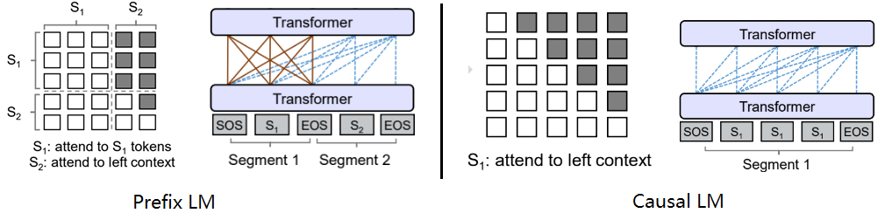
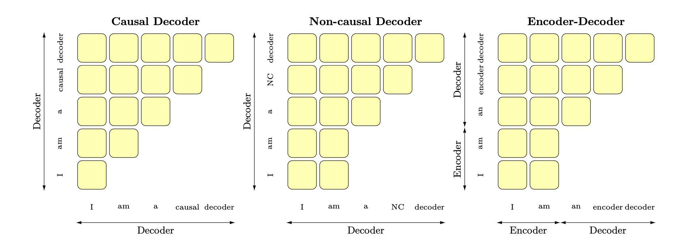

# 1. LLM 概念解析

## 1.1 目前主流的开源 LLM 体系

目前，主流的开源大语言模型（LLM）体系包括以下几种：

1. **GPT 系列（Generative Pre-trained Transformer）**：由 OpenAI 推出的系列模型，如 GPT-2、GPT-3 及后续版本。该系列采用自回归生成方式，在大规模无标签文本数据上进行预训练，并可通过微调适应特定任务。
2. **BERT（Bidirectional Encoder Representations from Transformers）**：由 Google 发布的双向 Transformer 语言模型，主要用于自然语言理解（NLU）任务，如文本分类、命名实体识别等。
3. **XLNet**：由 CMU 和 Google Brain 共同研发，采用自回归训练方式，克服了 BERT 训练中的遮蔽问题，提升了语言建模能力。
4. **RoBERTa**：Meta（Facebook）对 BERT 进行改进后的版本，采用更大规模数据、更长训练时间，提高了模型的鲁棒性。
5. **T5（Text-to-Text Transfer Transformer）**：由 Google 推出的统一文本处理框架，将所有 NLP 任务转换为文本生成问题，涵盖文本分类、问答、摘要生成等多种任务。

## 1.2 Prefix LM 与 Causal LM 的区别

### 1.2.1 Prefix LM（前缀语言模型）
Prefix LM 结合了编码器-解码器（Encoder-Decoder）架构的特性，采用特定的注意力掩码（Attention Mask）机制：

- **前缀部分（Prefix）** 采用自编码（Auto Encoding，AE）模式，即所有 Token 之间相互可见。
- **生成部分** 采用自回归（Auto Regressive，AR）模式，仅能看到 Encoder 侧的全部 Token 及 Decoder 侧已生成的 Token。

Prefix LM 主要用于任务如问答、文本生成等，典型模型包括 **UniLM、GLM**。

### 1.2.2 Causal LM（因果语言模型）
Causal LM 采用 **完全自回归** 方式，即每个 Token 仅能依赖于其之前的 Token，不能看到未来信息。该方式在 GPT 系列及 LLaMA 模型中广泛使用。

### 1.2.3 总结
- **Prefix LM** 适用于需要部分输入可见的任务，如文本补全、摘要生成。
- **Causal LM** 适用于完全自回归场景，如对话生成、开放域文本生成。

## 1.3 LLM 的训练目标

LLM 的主要训练目标是 **最大似然估计（Maximum Likelihood Estimation, MLE）**，即最大化模型生成的文本序列在训练数据上的概率。训练过程中，模型通过优化损失函数（通常为交叉熵）来提高文本生成的准确性和流畅度。

## 1.4 为什么大模型大多采用 Decoder-only 结构？

当前大部分 LLM 采用 **Decoder-only** 结构，主要原因包括：
1. **Encoder 存在低秩问题**：双向注意力可能降低模型的表达能力，而生成任务通常无需双向信息。
2. **更强的 Zero-Shot 能力**：Decoder-only 模型在零样本学习（Zero-shot）中表现优越，适用于大规模自监督学习。
3. **计算效率更高**：Decoder-only 结构可利用 KV-Cache 进行高效推理，适用于长文本生成与多轮对话。
虽然Encoder-Decoder（如T5）和Prefix-LM（如UNILM）兼具理解和生成能力，但它们仍然没有成为主流的LLM架构，主要有以下几个原因：

### 1.4.1 Encoder的低秩问题影响生成能力

**双向注意力导致Encoder存在低秩问题**，即它的表示能力可能受到限制，从而影响模型的泛化性。对于生成任务来说，增加双向注意力并没有明显优势，而Encoder-Decoder架构在某些任务上的表现优势**可能只是因为参数量更大**。因此，在相同的参数规模和计算资源下，Decoder-only通常是更优选择。

### 1.4.2 更好的Zero-Shot性能，适合大规模自监督学习

研究表明，**Decoder-only模型在zero-shot任务上的表现优于Encoder-Decoder**。例如，Google Brain 和 Hugging Face 的论文 *What Language Model Architecture and Pretraining Objective Work Best for Zero-Shot Generalization?* 发现，在 5B 规模的模型上，Decoder-only在**没有任何微调**的情况下表现最好，而Encoder-Decoder架构需要在有监督的多任务微调（multitask finetuning）后才能达到最佳效果。

目前LLM的训练范式是**基于大规模无监督数据进行自监督学习**，在这种情况下，**Decoder-only的Zero-Shot能力更好，可以更充分地利用无标注数据**。

此外，像InstructGPT这类模型在自监督学习之外还结合了**RLHF（基于人类反馈的强化学习）**，而RLHF主要依赖排序（ranking），不需要任务特定的标注数据，进一步强化了Decoder-only模型的优势。

### 1.4.3 计算效率更高，更适合长文本和对话

Decoder-only架构可以**高效利用KV-Cache**（键值缓存），避免重复计算，特别适用于长文本生成和多轮对话。而Encoder-Decoder和Prefix-LM架构由于需要双向编码，**难以做到高效的增量计算**，导致推理成本更高。

## 1.5 LLM 主要架构

Transformer 模型最初用于序列到序列（seq2seq）任务，包含 **Encoder** 和 **Decoder** 两个部分。
目前主流的 LLM 结构包括：
- **Encoder-only（BERT 代表）**：适用于文本分类、命名实体识别等任务。
- **Encoder-Decoder（T5、BART 代表）**：适用于机器翻译、摘要生成等任务。
- **Decoder-only（GPT 代表）**：适用于文本生成、对话系统。
- **Prefix LM（UniLM 代表）**：结合 Encoder-Decoder 和 Decoder-only 特性，适用于多种任务。

## 1.6 LLM 复读机（Parroting Problem）

### 1.6.1 概念
LLM 复读机问题是指模型在文本生成时**过度依赖输入文本的复制**，缺乏创造性。

### 1.6.2 形成原因
1. **数据偏差**：训练数据中的高频短语可能导致模型倾向于重复学习。
2. **训练目标局限**：基于 MLE 训练的模型更易生成类似文本。
3. **缺乏多样性训练**：单一数据源可能导致模型学习能力受限。
4. **模型架构限制**：Transformer 的注意力机制可能强化重复模式。

### 1.6.3 解决方案
1. **多样化训练数据**：确保训练数据覆盖丰富的语言表达方式。
2. **引入随机性**：如调整温度参数（Temperature）、Top-k 采样等方法。
3. **改进搜索策略**：优化 Beam 搜索以提高生成文本的创新性。
4. **后处理去重**：检测并过滤重复文本。
5. **人工干预**：在关键任务中加入人类审查环节。

## 1.7 何时选择 BERT、LLaMA 或 ChatGLM？

| 模型 | 适用任务 | 主要特点 |
|------|---------|---------|
| **BERT** | 文本分类、命名实体识别、语义匹配 | 采用 Encoder-only 架构，适合自然语言理解（NLU）任务 |
| **LLaMA** | 语言生成、推理、代码生成 | 采用 Decoder-only 架构，适用于开放域文本生成 |
| **ChatGLM** | 多轮对话、智能客服 | 采用 Prefix Decoder 架构，支持中英文文本生成 |

### 选择指南
- 需要 **精准理解**？→ **BERT**
- 需要 **生成长文本**？→ **LLaMA**
- 需要 **多轮对话**？→ **ChatGLM**

## 1.8 结论
LLM 的选择和应用取决于具体任务需求、计算资源、数据可用性等因素。合理选择架构，结合优化方法，可提升模型性能并减少常见问题，如复读机现象。未来，随着研究的深入，LLM 在多模态学习、自监督训练等方面仍有广阔的发展空间。

