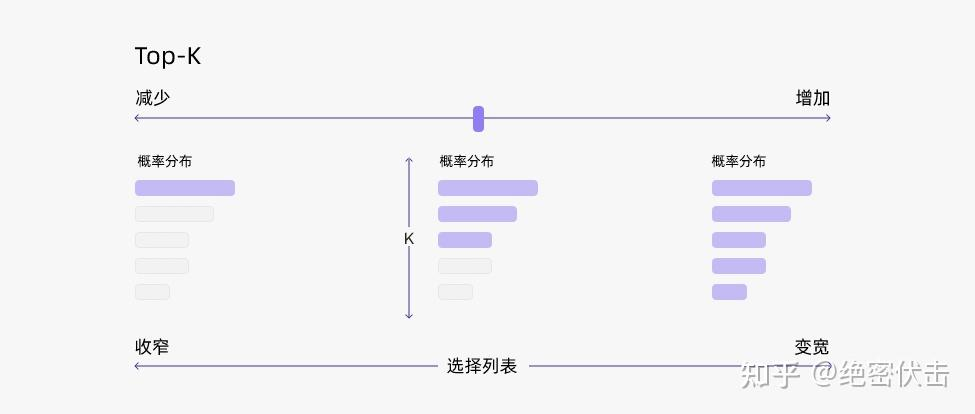
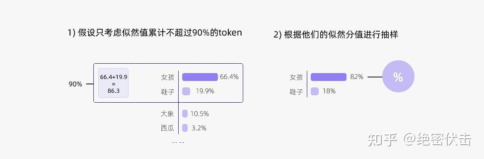

# 解码策略（Top-k & Top-p & Temperature）

## 0. 简介

在大模型训练完成后，如何对其进行解码（decode）成为了一个热门的研究方向。解码策略直接影响生成文本的质量、流畅性和多样性。

通常，输入给模型的解码参数如下所示：

```json
{
 "top_k": 10,
 "temperature": 0.95,
 "num_beams": 1,
 "top_p": 0.8,
 "repetition_penalty": 1.5,
 "max_tokens": 30000,
 "message": [
        {
 "content": "你好！",
 "role": "user"
        }
    ]
}
```

在自然语言生成任务中，预训练的大模型（如 GPT）会根据给定的输入文本（如一个开头或一个问题）逐步生成输出文本，直到满足终止条件（如达到最大长度或遇到终止标点）。在每一步，模型会预测下一个 token，并生成一个概率分布。例如，当输入文本为“我最喜欢的”时，模型可能给出的概率分布如下：


那么，应该如何从这个概率分布中选择下一个单词呢？常见的解码方法包括：

- **贪心解码（Greedy Decoding）**：始终选择概率最高的 token，简单高效，但可能导致文本过于单调和重复。
- **随机采样（Random Sampling）**：按照概率分布随机选择 token，可以增加多样性，但可能导致不连贯或无意义的文本。
- **Beam Search**：保留多个候选序列，每一步选择概率最高的候选 token 进行扩展，有助于提升质量，但可能导致文本过于保守。

这些方法各有优缺点，而 **Top-k 采样和 Top-p 采样是介于贪心解码与随机采样之间的折中方案**，也是目前大模型解码的常见策略。

---

## 1. Top-k 采样

在上面的示例中，**贪心解码**会选择概率最高的 token——“女孩”。虽然这是合理的，但它容易导致模型输出陷入重复循环。比如，在智能手机的自动补全建议中，连续选择概率最高的单词可能会生成冗余的句子。

**Top-k 采样**对贪心策略进行了优化，它从**概率最高的 k 个 token** 中随机采样，使得其他高概率但非最优的 token 也有机会被选择。这种增加随机性的方式有助于提高生成质量。

### Top-k 采样示例

Top-k 采样的基本思路是：  
在每一步，仅从概率最高的 k 个 token 中进行随机采样，而忽略低概率的 token。例如：

- 当 k=2 时，只从“女孩”和“鞋子”中随机选择一个 token，而不会考虑“大象”或“西瓜”。
- 这样可以避免模型选择过于罕见的单词，同时保留一定的创造性。

示意图如下：


当 k=1 时，Top-k 采样就退化为贪心解码：



### Top-k 采样代码实现

```python
import torch
from labml_nn.sampling import Sampler

class TopKSampler(Sampler):
    def __init__(self, k: int, sampler: Sampler):
        self.k = k
        self.sampler = sampler

    def __call__(self, logits: torch.Tensor):
        zeros = logits.new_ones(logits.shape) * float('-inf')
        values, indices = torch.topk(logits, self.k, dim=-1)
        zeros.scatter_(-1, indices, values)
        return self.sampler(zeros)
```

### Top-k 采样的优缺点

✅ **优点**：
- 动态调整候选 token 的数量，避免因概率分布变化而影响生成质量。
- 通过调整 k 的大小，可以控制文本的**多样性**（k 大）和**质量**（k 小）。
- 可与其他解码策略（如 Temperature 采样）结合，提高生成效果。

❌ **缺点**：
- 可能导致不符合常识或逻辑的文本，因为它仅关注概率最高的 token，而不考虑语法或上下文关系。
- 可能使文本过于简单或缺乏创意，因为低概率但有意义的 token 被排除在外。

为了解决这些问题，**Top-k 采样常与 Top-p 采样结合使用**。

---

## 2. Top-p 采样（核采样）

Top-k 采样的一个缺陷是：**如何选择合适的 k 值？**  
固定的 k 值可能在不同上下文下表现不佳。因此，提出了**Top-p 采样（Nucleus Sampling，核采样）**，它动态调整候选 token 的数量。

### Top-p 采样的基本思路

- 选择概率的**累积和**达到某个阈值 p 的最小 token 集合。
- 忽略低概率的 token，使采样范围更符合概率分布的“核心”部分。
- 例如，当 p=0.9 时，只保留累积概率达到 0.9 的 token，而忽略概率小于 0.9 的部分。

示意图如下：



### Top-p 采样代码实现

```python
import torch
from torch import nn
from labml_nn.sampling import Sampler

class NucleusSampler(Sampler):
    def __init__(self, p: float, sampler: Sampler):
        self.p = p
        self.sampler = sampler
        self.softmax = nn.Softmax(dim=-1)

    def __call__(self, logits: torch.Tensor):
        probs = self.softmax(logits)
        sorted_probs, indices = torch.sort(probs, dim=-1, descending=True)
        cum_sum_probs = torch.cumsum(sorted_probs, dim=-1)
        nucleus = torch.cat([nucleus.new_ones(nucleus.shape[:-1] + (1,)), nucleus[..., :-1]], dim=-1)
        sorted_log_probs = torch.log(sorted_probs)
        sorted_log_probs[~nucleus] = float('-inf')
        return self.sampler(sorted_log_probs)
```

Top-p 采样的常见 p 值为 **0.75–0.95**，可以与 Top-k 结合使用，即**先应用 Top-k，再应用 Top-p**。

---

## 3. Temperature 采样

**Temperature 采样**基于统计热力学的原理，通过调整 logits 进行归一化，使得模型的选择更具随机性或确定性。

公式如下：
$$
P(x_i) = \frac{e^{z_i/T}}{\sum_{j} e^{z_j/T}}
$$
其中：
- **T < 1**：使模型更倾向于高概率 token，生成的文本更确定。
- **T > 1**：使模型概率分布更加均匀，增加生成的多样性。

示意图：


Temperature 采样代码实现：

```python
import torch
from torch.distributions import Categorical

class TemperatureSampler(Sampler):
    def __init__(self, temperature: float = 1.0):
        self.temperature = temperature

    def __call__(self, logits: torch.Tensor):
        dist = Categorical(logits=logits / self.temperature)
        return dist.sample()
```

---

## 4. 联合采样（Top-k & Top-p & Temperature）

通常情况下，我们会**联合使用 Top-k、Top-p 和 Temperature** 进行解码，以获得更稳定且多样的文本生成：

1. **先使用 Top-k（如 k=3）** 保留概率最高的 3 个 token。
2. **再使用 Top-p（如 p=0.8）** 保留累积概率达到 0.8 的 token。
3. **最后使用 Temperature 采样（如 T=0.7）** 进行归一化。

举例。

首先设置 `top-k = 3`，表示保留概率最高的3个 token。这样就会保留女孩、鞋子、大象这3个 token。

- 女孩：0.664
- 鞋子：0.199
- 大象：0.105

接下来，可以使用 top-p 的方法，保留概率的累计和达到 0.8 的单词，也就是选取女孩和鞋子这两个 token。接着使用 Temperature = 0.7 进行归一化，变成：

- 女孩：0.660
- 鞋子：0.340

这种方法兼顾了多样性、流畅性和稳定性，使得文本生成更加自然和合理。
